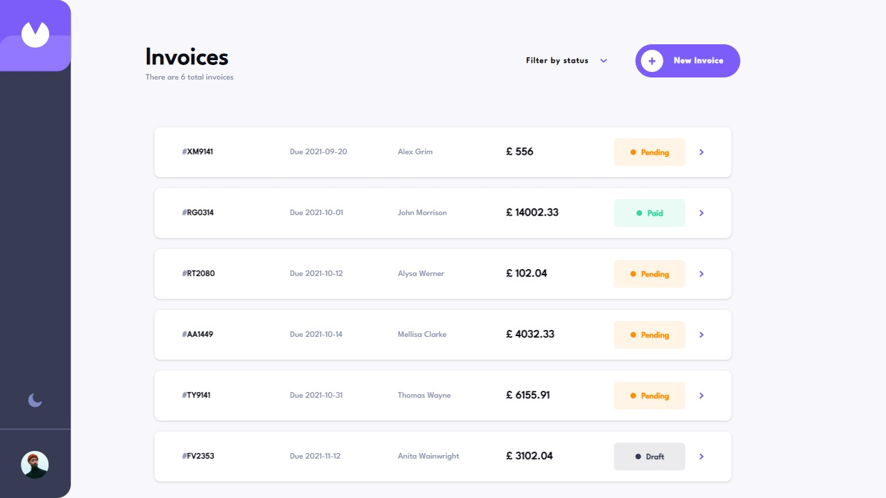

# Invoice app

This is a solution to the [Invoice app challenge on Frontend Mentor](https://www.frontendmentor.io/challenges/invoice-app-i7KaLTQjl). 

## Table of contents

- [Overview](#overview)
  - [The challenge](#the-challenge)
  - [Screenshot](#screenshot)
- [My process](#my-process)
  - [Built with](#built-with)
  - [What I learned](#what-i-learned)
- [Author](#author)

## Overview

### The challenge

Users should be able to:

- See hover states for all interactive elements on the page
- Create, read, update, and delete invoices
- Receive form validations when trying to create/edit an invoice
- Save draft invoices, and mark pending invoices as paid
- Filter invoices by status (draft/pending/paid)
- Keep track of any changes, even after refreshing the browser using localStorage

### Screenshot

## My process

### Built with

- [React](https://reactjs.org/) - JS library
- [Typescript](https://www.typescriptlang.org/) - programming language
- [Tailwind](https://tailwindcss.com/) - CSS framework
- [React_final_form](https://final-form.org/react) - form state management
- [Yup](https://www.npmjs.com/package/yup) - Object schema validation
- [Vite](https://vitejs.dev/) - Build tool
- [Prettier](https://prettier.io/) - Code formatter
- [ESLint](https://eslint.org/) - Syntax check

### What I learned

- how to work with typescript and tailwind
- how to use react final form with yup validation

## Author

- GitHub - [Marek Vcelak](https://github.com/VcelakMarek)
